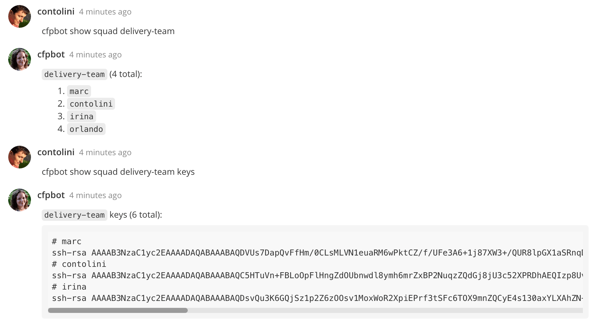

# Hubot Squads [](https://travis-ci.org/catops/hubot-squads.svg?branch=master) [](https://www.npmjs.com/package/hubot-squads)

:cat2: Create and manage teams (squads) using Hubot. Based on [hubot-team](https://github.com/hubot-scripts/hubot-team).



## Installation

Add **hubot-squads** to your `package.json` file:

```json
"dependencies": {
  ...
  "hubot-squads": "latest"
}
```

Add **hubot-squads** to your `external-scripts.json`:

```json
["hubot-squads"]
```

Run `npm install hubot-squads`


## Configuration

Some commands require an 'admin' role to be run (i.e. `clear` team list).
Use [hubot-auth](https://github.com/hubot-scripts/hubot-auth) to specify admins.


## Commands

```
hubot create squad <squad_name> - create squad called <squad_name>
hubot (delete|remove) squad <squad_name> - delete squad called <squad_name>
hubot (list|show) squads - list all existing squads
hubot add (me|<user>) to squad <squad_name> - add me or <user> to squad
hubot remove (me|<user>) from squad <squad_name> - remove me or <user> from squad
hubot (list|show) squad <squad_name> - list the people in the squad
hubot (list|show) squad <squad_name> keys - lists the public SSH keys for everyone in the squad, requires `hubot-keys`
hubot (empty|clear) squad <squad_name> - clear everyone from squad
```

----

## Open source licensing info
1. [TERMS](TERMS.md)
2. [LICENSE](LICENSE)
3. [CFPB Source Code Policy](https://github.com/cfpb/source-code-policy/)
